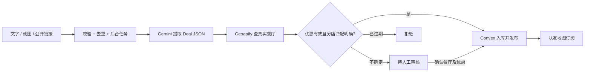

# 餐厅优惠 AI 整理 Workflow

这是独立的 **Convex + Gemini + Geoapify** 后端，可接入队友的 React、Next.js、手机 App 或服务端。现有 `map-site/` 网站模板不依赖此模块；地图 UI 由队友订阅已发布的优惠数据。

新增自然语言优惠搜索与到店推荐，接入说明见 [SEARCH.md](SEARCH.md)。无需 key 的搜索演示：`npm.cmd run demo:search`。可通过 adapter 接入现有 `map-component`。

Empty stored searches now fall back to Gemini with Google Search grounding. See [DISCOVERY.md](./DISCOVERY.md) for English integration instructions, citations, optional Geoapify branch verification, map adapters, and no-key/error behavior.



## 先运行，无需 API key

在 PowerShell 中：

```powershell
cd D:\indie_game_dev\AI\AI_Restaurant_deal\ai-workflow
npm.cmd ci
npm.cmd run typecheck
npm.cmd test
npm.cmd run demo
```

`demo` 使用明确标注的模拟餐厅和响应，生成 `output/demo-result.json`。测试覆盖真实 provider adapter 的请求格式和 Convex 的 HTTP、调度、读写、权限、审核、重试。测试不会调用付费 API。

## 之后填 key：两种运行方式

### 只在本机试 Gemini 提取

```powershell
Copy-Item .env.example .env.local
# 自己在 .env.local 填 GEMINI_API_KEY 和 GEOAPIFY_API_KEY
npm.cmd run process -- examples/text.json
```

结果写到 `output/result.json`，此方式不会入库。示例中的 Example Ramen 是虚构店铺，真实 Geoapify 找不到它会进入待审核；测试实际 API 时请换成真实帖子内容。

### 部署 Convex 后端，供队友接入

```powershell
npm.cmd run dev
```

第一次由你登录并创建/选择 Convex 项目。到 **Convex Dashboard → Settings → Environment Variables** 填：

| 变量 | 用途 |
| --- | --- |
| `GEMINI_API_KEY` | Gemini，必填 |
| `GEOAPIFY_API_KEY` | Geoapify，必填 |
| `GEMINI_MODEL` | 可选，默认 `gemini-2.5-flash`；可换成账号可用且支持结构化输出、图片与 URL context 的模型 |
| `GEMINI_FALLBACK_MODEL` | 可选，只有输出 JSON 无效/不完整时尝试这个模型 |
| `GEMINI_SEARCH_MODEL` | 可选，搜索理解和推荐使用的模型；默认复用 `GEMINI_MODEL` |
| `GEMINI_DISCOVERY_MODEL` | Optional Google Search grounding model for restaurant discovery; defaults to the search model |
| `WORKFLOW_API_TOKEN` | 使用 HTTP 写接口时必填，自己生成至少 32 字符的随机 secret |
| `AUTH_JWT_ISSUER` / `AUTH_JWT_AUDIENCE` | 只有浏览器直接使用 Convex 写接口时需要，与你们现有登录服务一致 |

本机 `.env.local` **不会自动变成 Convex 云端环境变量**。不要把私有变量加 `NEXT_PUBLIC_`/`VITE_` 前缀。云端写操作默认需要身份或集成 token。没有配置 JWT 时，直接浏览器提交会提示登录；服务端 HTTP 接入不依赖 JWT。生产部署运行 `npm.cmd run deploy`，并单独配置 production deployment 的变量。

Convex CLI 会生成自己的 deployment 信息与公开客户端 URL。这里没有预填任何真实 key，也没有创建/部署云项目。

## 输入接口

默认搜索范围：Vancouver、British Columbia、Canada；默认时区 `America/Vancouver`。`context` 可整体省略；它只辅助查地点，不作为优惠内容证据。

文字：

```json
{
  "source": {
    "type": "text",
    "text": "真实餐厅的优惠帖子文字……",
    "sourceUrl": "https://restaurant.example/offers",
    "publishedAt": "2026-10-03"
  },
  "context": {
    "city": "Richmond",
    "region": "British Columbia",
    "countryCode": "ca",
    "timezone": "America/Vancouver"
  }
}
```

公开网页：

```json
{ "source": { "type": "url", "url": "https://restaurant.example/offers" } }
```

截图：

```json
{
  "source": {
    "type": "image",
    "mimeType": "image/png",
    "data": "这里放纯 base64，不含 data:image/png;base64, 前缀",
    "caption": "可选的说明文字",
    "publishedAt": "2026-10-03"
  }
}
```

`publishedAt` 是**原帖发布日期**，不要把分享当天自动填成原帖日期。不知道时省略，系统会要求审核。图片支持 PNG/JPEG/WebP，base64 最多 450,000 字符（约 337 KB），需先压缩大截图；文字上限 30,000 字符；单次最多 10 条优惠。HTTP 请求整体上限 600 KB。输入不允许额外未定义字段。

链接通过 Gemini URL context 读取，再单独做结构化提取。需要登录的 Instagram/TikTok 帖子、付费墙、视频和读取失败的网页不会被猜测：返回 `SOURCE_UNREADABLE`，改传文案或截图。此模块没有社交平台登录爬虫，也没有视频下载器。

## 队友接入 A：服务端 HTTP（无需共用前端框架）

用 Convex 的 **`https://<deployment>.convex.site`** HTTP URL。`convex.cloud` 是客户端函数 URL，两者不要混用。

| 方法和路径 | 行为 | 授权 |
| --- | --- | --- |
| `POST /v1/jobs` | 提交上述输入，返回 `{ jobId, duplicate }`，HTTP 202 | Bearer token |
| `GET /v1/jobs?id=...` | 获取状态、提取快照、审核结果和安全错误 | Bearer token |
| `POST /v1/jobs/retry` | `{ jobId }`，重跑失败/未审核任务 | Bearer token |
| `POST /v1/deals/review` | `{ dealId, decision: "approve"或"reject", placeId?: "..." }` | Bearer token |
| `GET /v1/deals?limit=100` | `{ deals: [...] }`，只读已发布且未过期的地图数据 | 公开 |
| `POST /v1/search` | Search stored offers first; use grounded Gemini restaurant discovery if none match | Bearer token |
| `POST /v1/deals/pitch` | 为指定 `focusDealId` 生成符合用户偏好的到店推荐理由 | Bearer token |

完整 TypeScript 服务端 client 在 `examples/teammate-server.ts`。示例：

```ts
const client = new DealWorkflowClient(process.env.DEAL_WORKFLOW_SITE_URL!, process.env.DEAL_WORKFLOW_TOKEN!);
const { jobId } = await client.submit(input);
const job = await client.get(jobId);
// queued/processing 时，UI 提示处理中；可每 2–3 秒查询，完成或失败后停止。
// completed 时，读取 job.deals；审核时从其 candidates 选 placeId。
```

Bearer token 只保存在队友的服务端；浏览器通过队友已有的后端路由提交。所有持有同一 token 的调用者共用 `integration` 任务空间，适用于受信任团队服务；你的后端路由仍需执行自己应用的用户权限校验。HTTP 接口没有开放跨域写入配置。

## 队友接入 B：Convex 实时接口

浏览器直连写操作需已有 JWT 登录，配置上面两项 `AUTH_JWT_*` 并将登录 token 交给 Convex 客户端。使用 `convex/react` 的 `ConvexProvider`/对应 auth provider，然后：

```ts
import { api } from "./convex/_generated/api";
import { useMutation, useQuery } from "convex/react";

const submit = useMutation(api.jobs.submit);
const { jobId } = await submit({ inputJson: JSON.stringify(input) });
const job = useQuery(api.jobs.get, { jobId });
const mapDeals = useQuery(api.deals.listForMap, {
  limit: 100,
  bounds: { west: -123.3, east: -122.8, south: 49.0, north: 49.4 }
});
const review = useMutation(api.deals.reviewDeal);
await review({ dealId, decision: "approve", placeId });
```

这些 hook 分别放在 React 组件顶层；上面是接口用法摘要，提交和审核调用放入事件处理函数。地图订阅无需登录。把返回的 `restaurant.longitude` 和 `restaurant.latitude` 按 `[longitude, latitude]` 传给 MapLibre marker。地图端保留 Geoapify/底图提供商要求的 attribution。

## 输出与审核规则

Job 状态：`queued → processing → completed`，失败时 `failed`。`completed` 表示处理结束；其中优惠仍可能待审核或被拒绝。任务 `result` 是首次提取快照；审核后的当前状态以 `job.deals[].status` 为准。

每条优惠包含餐厅名、标题、说明、价格/币种、折扣、星期、起止时间/日期、条件、地点/地址线索、原文证据、置信度和警告。未知字段保留 `null`/空数组。坐标只来自 Geoapify 实际餐饮 POI；城市中心点不被当作餐厅。

- `published`：提取置信度 ≥ 0.88、餐厅名称/地址匹配明确、无相近分店候选、有效期信息足够且原帖日期合理。
- `needs_review`：缺发布日期、币种/有效期不明、信息警告、地址矛盾、分店歧义、无匹配或地点 API 失败。保留候选与原因；地图不显示。
- `rejected`：过期优惠或人工拒绝。非优惠文字只记录任务的拒绝理由，不创建优惠。

只有任务所有者（或团队集成服务）可以审核。批准意味着审核者已核实价格、条件、日期和分店；只能选择该任务 Geoapify 已返回的候选，不能随意填坐标。无候选时需重试或用更明确的原文/地址重新提交。

按本地时区判定结束日期，允许跨午夜的时间范围。地图数据保留星期、时间和未来开始日期，前端可进一步显示“今天可用/即将开始”，此查询没有承诺所有结果此刻都可兑换。到期优惠由查询过滤，并每 15 分钟清理已发布记录，触发实时更新。

同一所有者的相同输入去重，不重复调用 AI；不同内容/来源会建立新任务。每个所有者每小时最多 20 次新提交/重试。外部调用最多尝试 3 次，整体预算约 4 分钟；仅可选 fallback 模型处理无效 JSON。失败、未审核的完成任务及卡住 15 分钟的任务可手动重试；已审核/发布的任务不能重跑。attempt 编号防止旧 worker 覆盖新结果。

## 文件职责与当前边界

- `src/contracts.ts`：输入、Deal、地点、结果和 Gemini JSON Schema，队友的统一数据约定。
- `src/gemini.ts` / `src/geoapify.ts`：提取及真实地点匹配。
- `src/workflow.ts`：可脱离 Convex 调用的 `processDeal()`。
- `convex/jobs.ts` / `ai.ts`：后台调度、限流、去重、原子入库、失败和重试。
- `convex/deals.ts` / `http.ts`：审核、实时地图、HTTP 集成。
- `convex/schema.ts`：jobs、restaurants、deals、limits、searchLimits 表。
- `src/search*.ts` / `convex/search.ts`：搜索意图、筛选、证据推荐、基础 fallback 和搜索限流。

本机已验证模拟响应与数据库运行流程。**真实 Gemini/Geoapify 响应、你的云项目部署、队友登录系统和地图 UI 尚需填 key 后联调。**地图接口最多扫描最近 500 条已发布记录，最多返回 100 条；MVP 量级使用，扩大数据量后改为分页和地理索引。无到期日的已确认 recurring deal 需运营定期复核。

现有 Convex 项目接入时需合并 schema 和 HTTP router，安装此包的 dependencies，复制 `src/` 与相关 `convex/` 文件并重新 `convex dev`；不要覆盖队友已有表、路由或 auth 配置。已提供可在无云账号情况下 typecheck 的 `_generated/` bootstrap；正常 `convex dev` 会自动重新生成。`npm.cmd run codegen:offline` 仅供初始离线开发。

官方参考：[Gemini generateContent / JSON schema](https://ai.google.dev/api/generate-content)、[Geoapify Places](https://apidocs.geoapify.com/docs/places/)、[Convex Actions](https://docs.convex.dev/functions/actions)、[Convex scheduled functions](https://docs.convex.dev/scheduling/scheduled-functions)。

## Restaurant comparison

See [COMPARISON.md](./COMPARISON.md) for the English comparison API and teammate integration. `POST /v1/deals/compare` and `api.compare.find` compare two to five published offers from different restaurant locations. Priorities are `value`, `price`, and `taste`; taste-first suggestions require sourced food review excerpts for every selected restaurant. The API retains restrictions and unknown fields, validates AI evidence references, and returns an explicitly labelled evidence-only result when AI is unavailable. Run `npx.cmd tsx scripts/demo-comparison.ts` for the fictional, mocked-provider demo.
